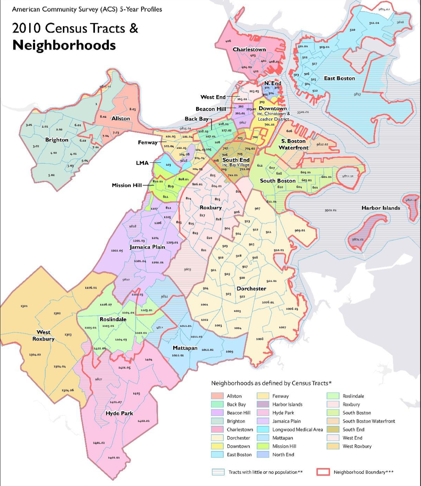

# Data sources

## 311 Service Request Data

The 311 service request data from 2018 to 2021 is downloaded from  [**City of Boston 's open data hub**](https://data.boston.gov/dataset/311-service-requests). The datasets includes all channels of engagement in which a service request is crated from year 2018 - 2021. In total, there are 1,047,926 cases. Below is the table of variables in this data set.

```{r}
descrip311=read.csv('data/description_311.csv')
knitr::kable(descrip311,
             caption = "Feature Description of 311 request dataset")
```
### Response Metrics

There are four response metrics in this study:

- **Close Rate**: Number of close cases divided by total number of requests. The close cases are identified from 'case status'.

- **Resolved Rate**: Number of resolved cases divided by total number of requests. The resolved cases are identified from 'closure_reason'. 

- **Awaiting Time**: Time period between open time and closed time of a request which is 'closed_dt' - 'open_dt'. 

- **Number of Requests  Per Capita**: Total number of requests in a neighborhood accumulated by four years divided by the population of that neighborhood. Population data will be described below. 

## Demographic Data

Demographic related data grouped by neighborhoods, including race, per capita income, education level, poverty rate, is also downloaded from  [**City of Boston 's open data hub**](https://data.boston.gov/dataset/neighborhood-demographics) compiled by Boston Planning and Development Agency (BPDA). Since cencus data is not collected in every year, 2015-2019 dataset is the most recent available 5-year American Community Survey (ACS) neighborhood demographic data. The demographic data is joined with 311 requests dataset by neighborhood.

<center>
{width=50%}


