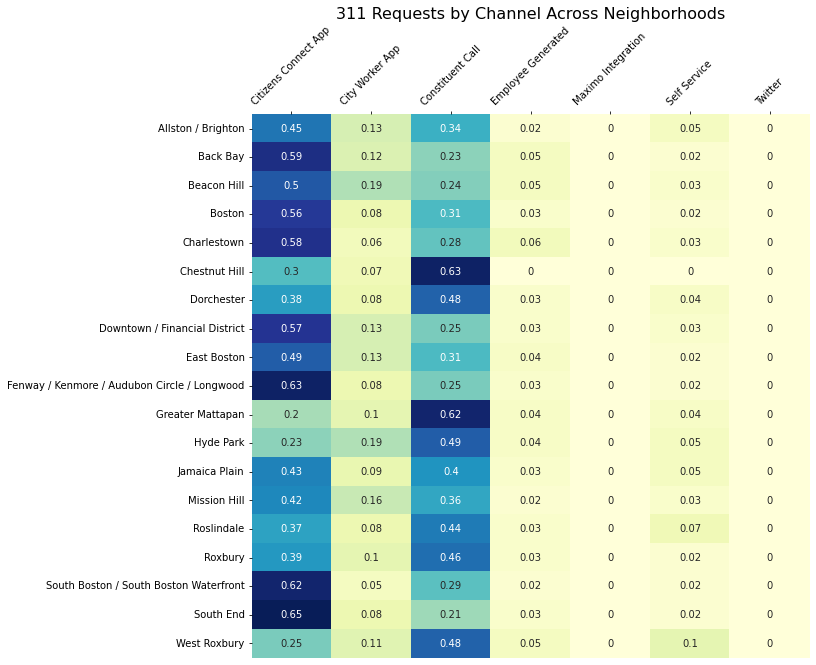
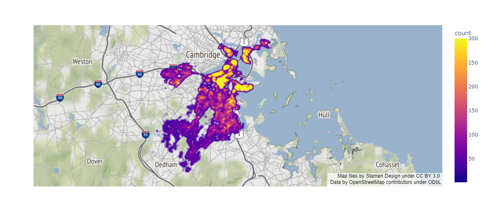
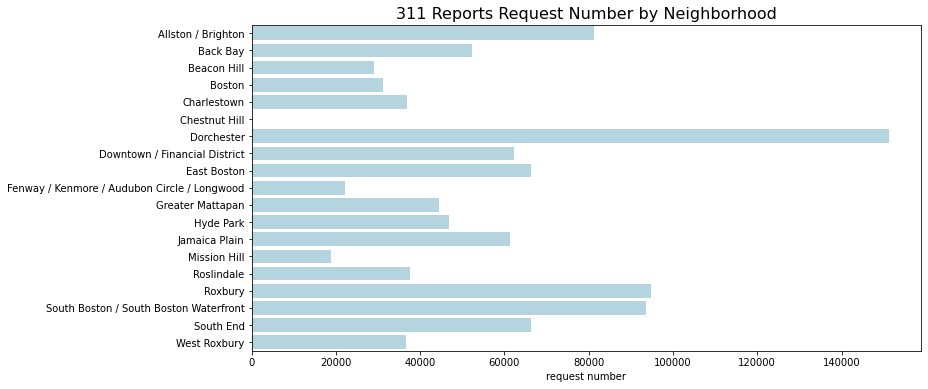
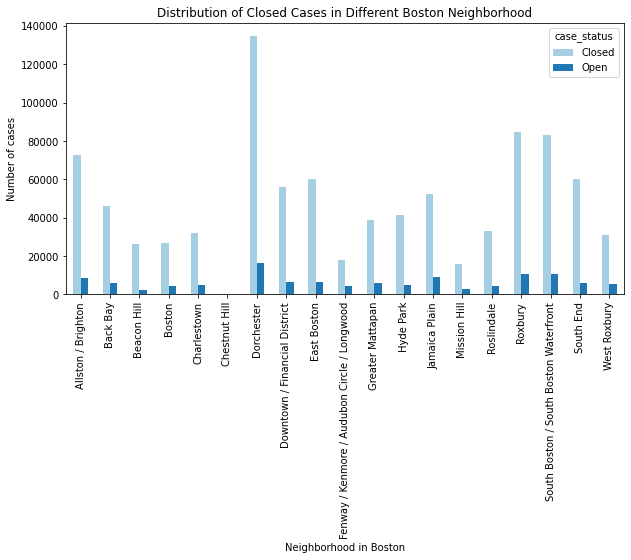
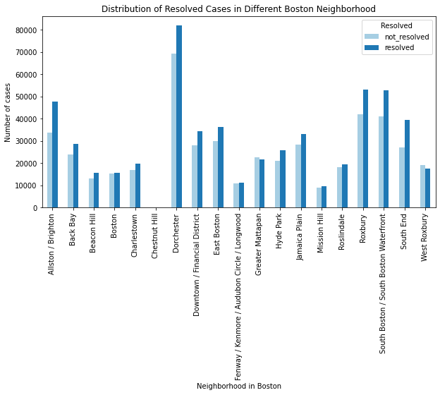
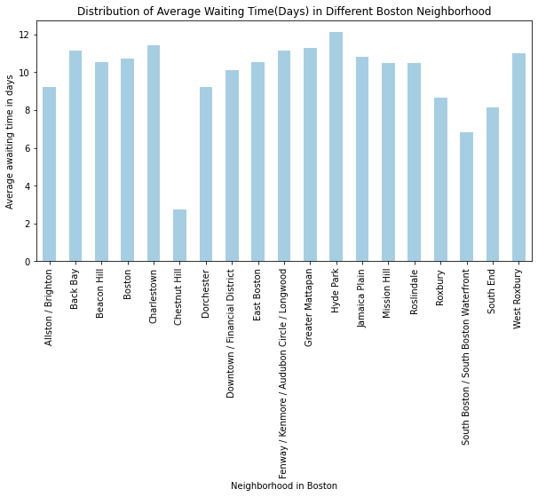
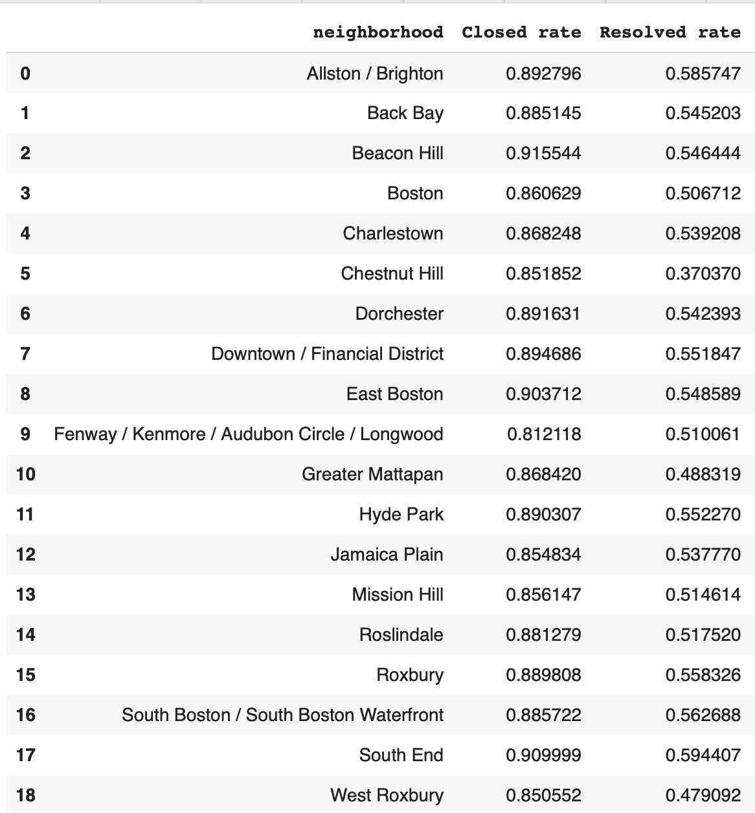

# Exploratory Data Analysis

## Longitudinal Analysis

We first examine the time trend of the request number in four years. The graph below shows a seasonality trend in each year, where it increases first, peaks in summer season, then decreases. We can also notice that there is a sharp drop in request number in week 10 to week 15 of 2020. A possible explanation would be the start of Covid-19 which leads citizens to stay at home and make less requests. 

{width=80%}

## Distribution Analysis across Neighborhood

**311 Requests by Different Channels across Neighborhood**

There are six channels that citizens could use to report their requests. After grouping the requests by neighborhoods, Heatmap is used to show the distribution of number of requests from different channels. The graph shows that there are slightly difference in the distribution of channels of different neighborhoods. 
Though the most commonly used channels are citizens connect APP and 311 phone calls, some neighborhoods (e.g. Back Bay, South Boston/ South Boston Waterfront) use APP more often, but some neighborhoods (e.g. Chestnut Hill, Greater Mattapan) use phone call more often. 

{width=80%}

**311 Report Request Number in Different Neighborhood**

{width=80%}

The map intuitively shows that 311 report request numbers vary a lot geographically. The northern part is yellower than the southern part which indicates that citizens in the northeastern part generates more requests than the citizens in the southwestern part. In order to quantitatively compare the request numbers in every neighborhood, a bar plot is further generated. Dorchester is the neighborhood that has the largest number of requests followed by Roxbury and South Boston/ South Boston Waterfront. They all located in the middle or the northern part of the previous map. In contrast, Chestnut Hill, Mission Hill, and Fenway/ Kenmore/ Audubon Circle/ Longwood are the neighborhoods with lower than of request numbers. Those neighborhoods are located in the western part.

{width=80%}

**Distribution of Close Cases in Different Boston Neighborhoods**

Most neighborhoods have close rate higher than 85%. Chestnut Hill, Fenway/ Kenmore/ Audubon Circle/ Longwood is the only neighborhood has close rate (81.21%) lower than 85%. Beacon Hill has the highest closed rate (91.55%), followed by South End (91%) and East Boston (90.37%). 

{width=80%}

**Distribution of Resolved Cases in Different Boston Neighborhoods**

From the graph above, Greater Mattapan and West Roxbury are the two neighborhoods that have non_resolved cases numbers higher than resolved cases numbers which indicates the resolved rate is lower than 50%. Among the other neighborhoods, South End (59.44%) and Alluston/ Bringhton (58.57%) have relatively high resolved rates; whereas, Fenway / Kenmore / Audubon Circle / Longwood (51.01%), Mission Hill (51.46%), Boston (50.67%) have relatively low resolved rates.

{width=80%}

**Distribution of Average Awaiting Time in Different Boston Neighborhoods**

On average, people need to wait at least a week for a case to be closed except in Chestnut Hill which might due to the extreme low number of cases. South Boston/ South Boston Waterfront, South End, and Roxbury have relatively short waiting time compared to Hyde Park, Charlestown, and West Roxbury where people need to wait longer.

{width=80%}

<!-- Close rate and resolved rate in each neighborhood: -->

<!-- 
 -->
<!-- {width=50%,height=60%} -->
<!-- 
 -->

