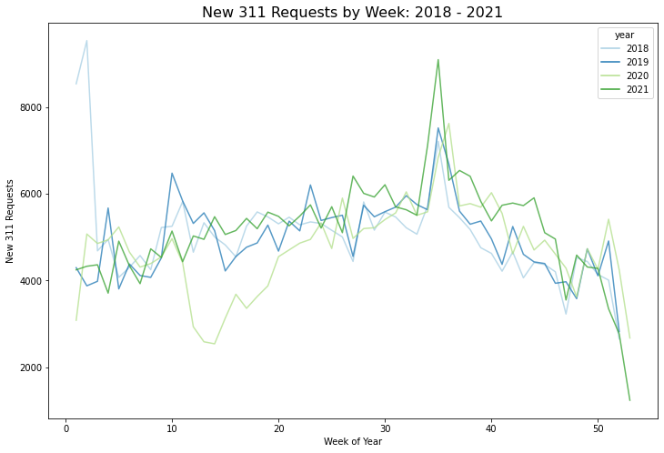

# Exploratory Data Analysis

## Longitudinal Analysis

We first examine the time trend of the request number in four years. The graph below shows a seasonality trend in each year, where it increases first, peaks in summer season, then decreases. We can also notice that there is a sharp drop in request number in week 10 to week 15 of 2020. A possible explanation would be the start of Covid-19 which leads citizens to stay at home and make less requests. 

{width=60%}

## Distribution Analysis

## Response Metrics Analysis