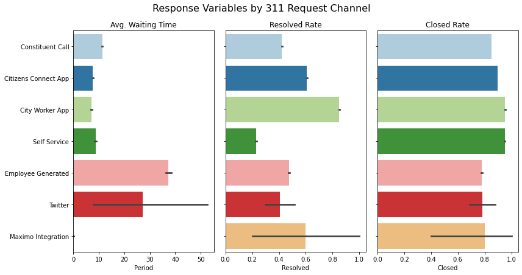
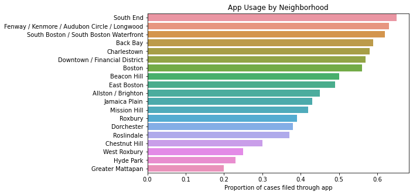
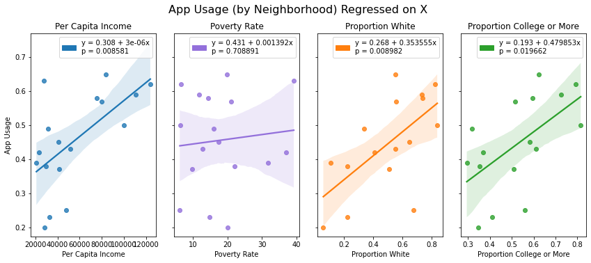

# Fairness Analysis

## Fairness Analysis Based on Neighborhood

### 311 Interaction Level Across Different Neighborhoods
<center>
{width=80%}
</center>

**Summary:** A regression analysis shows that the variance in 311 reports per capita is associated with demographic characteristics such as income, race, and education (p < 0.01, 0.1, 0.05 respectively).  

**Significance:** Given that 311 services need to be requested to be provided, we can assume that neighborhoods with more 311 requests per capita will receive disproportionate benefits from city services compared with those that file fewer requests per capita (assuming all requests are attended to equally and the feasibility of resolving requests doesn't vary across neighborhoods). 

Importantly, these results demonstrate an inversion of the socially desirable allocation of resources, whereby needy neighborhoods would be the ones receiving the most support from city services. In our case, it seems like a reasonable assumption that less well-off neighborhoods are the ones that are most in need of the services offered through 311 (e.g. repairs, cleaning, beautification, maintenance etc.), but it is well-off neighborhoods that are receiving disproportionate benefits from 311 based on their higher propensity to seek services. 

**Interpretation:** There are many possible explanations for this finding. People in less well-off neighborhoods may file fewer 311 requests per capita due to a lack of awareness of 311 services, mistrust of government, less leisure time to file cases, language barriers, or preference for local community-oriented problem solving rather than reliance on city government.   


### Close rate, Resolved Rate, Awaiting Time Across Different Neighborhoods

In this section, we explore whether these are differences in close rate, resolved rate and awaiting time across different neighborhoods by calculating correlation and applying linear regression.

#### Race
<center>
{ height="220"}
</center>
<center>
{ height="220"}
</center>
```{r}
percent_white=c(0.050764,0.197647,-0.14547)
percent_black=c(-0.163486,-0.335092,0.167532)
tab <- matrix(c(percent_white,percent_black),byrow=TRUE, ncol=3)
colnames(tab) <- c('Close rate','Resolved Rate','Average awaiting time')
rownames(tab) <- c('White proportion','Black proportion')
df <- as.data.frame(tab)
knitr::kable(df,
             caption = "Correlation between Response Metrics and Race")
```

Statistically, there is no significant relation between close rate, resolved rate and awaiting time and racial structure within neighborhood from the p-value of three corresponding regressions and correlation values. Recap from the previous section, the average awaiting time all neighborhood is between 7 days and 12 days (except Chestnut Hill because of extremely small sample size). Long awaiting time can happen in any neighborhood no matter the withe is majority or the black is the majority. For example, in Hyde Park, black population is obviously higher than other race and in West Roxbury, white population is much higher than other racial. On the other hand, short awaiting time can also appear in both neighborhoods with more withe and neighborhood with more black. For example, Dorchester and Allston/Brighton are Black and White dominated respectively but the average awaiting time are both around 9 days. However, the average awaiting time in these two neighborhoods are both very long (more than 11 days). Therefore, we think there is no obvious racial discrimination in processing 311 requests.

#### Income
</center>
<center>
{ height="220"}
</center>
```{r}
income=c(0.359678,0.369287,-0.323304)
tab <- matrix(income,byrow=TRUE, ncol=3)
colnames(tab) <- c('Close rate','Resolved Rate','Average awaiting time')
rownames(tab) <- c('Per capita income')
df <- as.data.frame(tab)
knitr::kable(df,
             caption = "Correlation between Response Metrics and Income")
```
Based on the p-value from regression relation and the correlation value between three response metrics and per capita income, there is no significant relation between income and all three response metrics (closed rate, resolved rate and awaiting time). Recap that there are only three neighborhoods with closed rate higher than 90%: Beacon Hill, East Boston and South End. But the per capita income in Beacon Hill almost triples the per capita income in East Boston. Combined with the plot of awaiting time in different neighborhoods, the awaiting time in Back Bay and West Roxbury are both high but the per capita income in Back Bay almost doubles the per capita income in West Roxbury. Therefore, we think the relation between per capita income and fairness in processing 311 request is not obvious from the given information.

#### Education Level

</center>
<center>
{ height="220"}
</center>
```{r}
edu=c(0.158577,0.264236,-0.204174)
tab <- matrix(edu,byrow=TRUE, ncol=3)
colnames(tab) <- c('Close rate','Resolved Rate','Average awaiting time')
rownames(tab) <- c('Proportion of bachelor or higher')
df <- as.data.frame(tab)
knitr::kable(df,
             caption = "Correlation between Response Metrics and Education Level")
```

We cannot tell that there is significant relationship between education level and closed rate/ resolved rate and awaiting time from regression results and correlation values. Ferway/ Kenmore/ Audubon Circle/ Longwood is the only neighborhood with closed rate lower than 85% but the population with bachelor degree or more is the absolute majority in the neighborhood. Recap that Mattapan and West Roxbury are the two neighborhoods with resolved rate lower than 50%, but proportion of bachelor or higher people in West Roxbury is much higher than that in Mattapan. For awaiting time, neighborhoods that have longer awaiting time and neighborhoods with shorter awaiting time can have similar education level structure. For example, in Charlestown and South Boston/ South Boston Waterfront, people with bachelor degree or more is absolute the majority but the average awaiting time in Charlestown is nearly 12 days but the average awaiting time in South Boston/ South Boston Waterfront is only about 7 days.

#### Poverty Rate
</center>
<center>
{ height="220"}
</center>
```{r}
edu=c(-0.42111,-0.073302,0.000929)
tab <- matrix(edu,byrow=TRUE, ncol=3)
colnames(tab) <- c('Close rate','Resolved Rate','Average awaiting time')
rownames(tab) <- c('Poverty rate')
df <- as.data.frame(tab)
knitr::kable(df,
             caption = "Correlation between Response Metrics and Poverty Rate")
```

Similar with education level, there is no significant relationship between poverty rate and closed rate/ resolved rate/ waiting time from the linear regression results and correlation values. Both Neighborhoods with low poverty rate and neighborhoods with high poverty rate can have high closed rate. For example, the poverty in Roxbury(0.33%) is much higher than that in West Roxbury(6%), but the closed rate in Roxbury(89%) is higher than that in West Roxbury(85%). As for resolved rate, there are neighborhoods with high poverty rate (such as Roxbury) that have high resolved rate, but there are also neighborhoods with low poverty rate (such as South Boston/ South Boston Waterfront) that have high resolved rate. The poverty situation in neighborhoods that have longer waiting time is also a mix. Citizens in Fenway/ Kenmore/Audubon Circle/ Longwood (neighborhood with highest poverty rate) and West Roxbury (neighborhood with lowest poverty rate) both need to wait a long time.

#### Summary

For all four demographic factors: population, income, poverty and education level, there are no obvious relation between them and response metric. Although, we can see differences in these three metrics across neighborhoods, demographic factors are not explainable in these differences and we cannot tell any demographic discrimination in processing 311 requests. There might be other factors that cause the differences in response metrics.

## Fairness Analysis Based on Channel

### Number of Requests by Channel vs.Closed rate, Responsed Rate, Awaiting Time
<center>

</center>

**Summary:** From this portion of our analysis, we can see that there are statistically significant differences in our response metrics based on which channel a 311 request is filed through. The differences between "Constituent Call" and "Citizens Connect App" are the most important, as these two channels are used by citizens in 83% of all cases filed (46% app, 37% call). 

**Significance:** In terms of outcomes, the app appears to be a better channel for filing cases. Cases filed through the app have a significantly shorter waiting time than cases filed over the phone (7.6 days compared to 11.3 days), a much higher resolution rate (61% compared to 42%), and a higher close rate (90% compared to 85%). We suspect these differences are due to the amount and quality of information collected through each channel. The app collects useful data that does not come through phone requests, such as photos and geo-coordinates. The app also provides a more consistent, form-based structure for information gathering, whereas phone requests are more conversational. As a result, cases filed through the app may be easier for case workers to scope, understand, locate, and resolve.

**Implications:** These findings may have important implications on the fairness of Boston's 311 services. If app usage varies across neighborhoods, some may end up receiving better service than others (i.e. faster response time, higher resolution rate, more case closure). It would be more troubling if app usage were to correlate with neighborhood-level demographic characteristics such as race, income, and education. The next section explores these questions. 


### App Usage vs. Demographic Information
<center>

</center>

<center>

</center>

**Neighborhood-level app usage:** First, we find that there is a large amount of variance in app usage by neighborhood. Some, such as South End, have more than 60% of their cases filed through the app, while others, such as Greater Mattapan, have roughly 20%. Based on our previous analysis, we would expect those neighborhoods with higher app usage to receive better services.

**Demographic Differences:** More concerning is the association that app usage has with demographic characteristics. Neighborhoods that are richer, whiter, and more educated have significantly higher rates of app usage (p < 0.01 for per capita income and education, p < 0.05 for whiteness), suggesting that well off neighborhoods are more likely to receive fast and effective service by virtue of their higher propensity to use the app. 

**Possible Explanations:** The differences in app usage and its correlation with neighborhood-level demographic characteristics may be due to several factors. First, citizens in well-off neighborhoods may be more likely to have smartphones. Second, they may be more aware of the Citizen Connect App due to marketing or word of mouth. Third, they may belong to demographic groups that would have an easier time using the app effectively (e.g. younger, more tech-savvy, and higher english proficiency). The 311 phone service may be comparatively attractive to citizens who don't have access to the app or prefer the phone line due to technological or language constraints. 

**Recommendations:** The city should aim to equalize its service provision across neighborhoods by expanding app usage into less well-off neighborhoods and improving case outcomes from phone requests. This effort should involve 1) studying why discrepancies in channel usage exist, 2) making an effort to raise awareness and adoption of the Citizen Connect App, 3) ensuring equal accessibility on both the app and phone line (e.g. any language offered on the phone line should be supported by the app), and 4) streamlining the data collection and case resolution process for phone requests.

