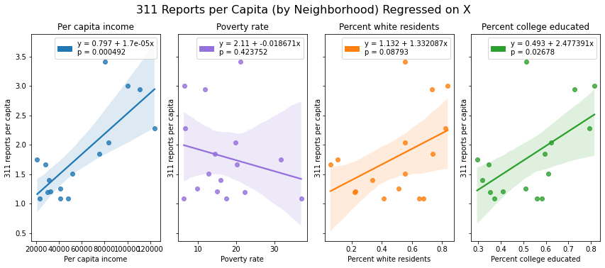
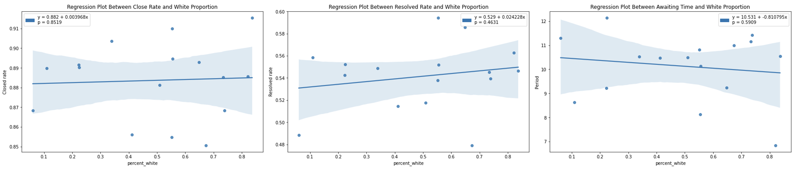
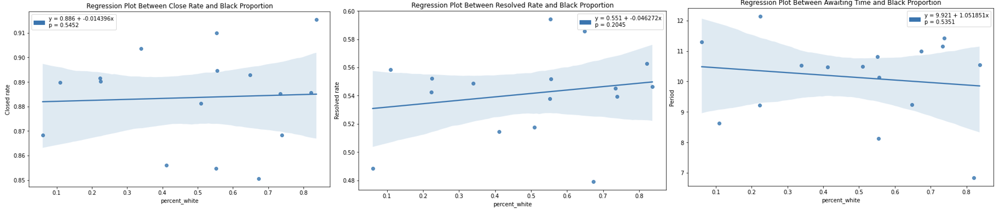
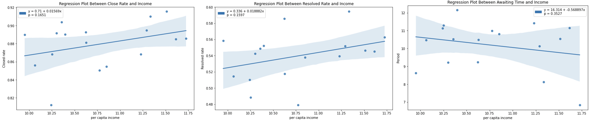
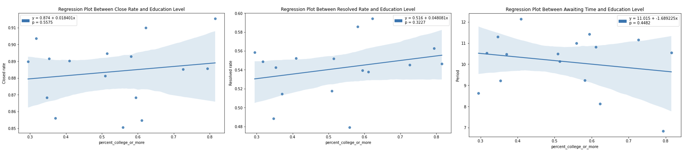
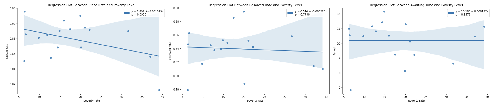

# Fairness Analysis

## Fairness Analysis Based on Neighborhood

### 311 Interaction Level Across Different Neighborhoods
<center>
{width=80%}
</center>

### Close rate, Resolved Rate, Awaiting Time Across Different Neighborhoods

In this section, we explore whether these are differences in close rate, resolved rate and awaiting time across different neighborhoods by calculating correlation and applying linear regression.

#### Race
<center>
{ height="220"}
</center>
<center>
{ height="220"}
</center>
```{r}
percent_white=c(0.050764,0.197647,-0.14547)
percent_black=c(-0.163486,-0.335092,0.167532)
tab <- matrix(c(percent_white,percent_black),byrow=TRUE, ncol=3)
colnames(tab) <- c('Close rate','Resolved Rate','Average awaiting time')
rownames(tab) <- c('White proportion','Black proportion')
df <- as.data.frame(tab)
knitr::kable(df,
             caption = "Correlation between Response Metrics and Race")
```

Statistically, there is no significant relation between close rate, resolved rate and awaiting time and racial structure within neighborhood from the p-value of three corresponding regressions and correlation values. Recap from the previous section, the average awaiting time all neighborhood is between 7 days and 12 days (except Chestnut Hill because of extremely small sample size). Long awaiting time can happen in any neighborhood no matter the withe is majority or the black is the majority. For example, in Hyde Park, black population is obviously higher than other race and in West Roxbury, white population is much higher than other racial. On the other hand, short awaiting time can also appear in both neighborhoods with more withe and neighborhood with more black. For example, Dorchester and Allston/Brighton are Black and White dominated respectively but the average awaiting time are both around 9 days. However, the average awaiting time in these two neighborhoods are both very long (more than 11 days). Therefore, we think there is no obvious racial discrimination in processing 311 requests.

#### Income
</center>
<center>
{ height="220"}
</center>
```{r}
income=c(0.359678,0.369287,-0.323304)
tab <- matrix(income,byrow=TRUE, ncol=3)
colnames(tab) <- c('Close rate','Resolved Rate','Average awaiting time')
rownames(tab) <- c('Per capita income')
df <- as.data.frame(tab)
knitr::kable(df,
             caption = "Correlation between Response Metrics and Income")
```
Based on the p-value from regression relation and the correlation value between three response metrics and per capita income, there is no significant relation between income and all three response metrics (closed rate, resolved rate and awaiting time). Recap that there are only three neighborhoods with closed rate higher than 90%: Beacon Hill, East Boston and South End. But the per capita income in Beacon Hill almost triples the per capita income in East Boston. Combined with the plot of awaiting time in different neighborhoods, the awaiting time in Back Bay and West Roxbury are both high but the per capita income in Back Bay almost doubles the per capita income in West Roxbury. Therefore, we think the relation between per capita income and fairness in processing 311 request is not obvious from the given information.

#### Education Level

</center>
<center>
{ height="220"}
</center>
```{r}
edu=c(0.158577,0.264236,-0.204174)
tab <- matrix(edu,byrow=TRUE, ncol=3)
colnames(tab) <- c('Close rate','Resolved Rate','Average awaiting time')
rownames(tab) <- c('Proportion of bachelor or higher')
df <- as.data.frame(tab)
knitr::kable(df,
             caption = "Correlation between Response Metrics and Education Level")
```

We cannot tell that there is significant relationship between education level and closed rate/ resolved rate and awaiting time from regression results and correlation values. Ferway/ Kenmore/ Audubon Circle/ Longwood is the only neighborhood with closed rate lower than 85% but the population with bachelor degree or more is the absolute majority in the neighborhood. Recap that Mattapan and West Roxbury are the two neighborhoods with resolved rate lower than 50%, but proportion of bachelor or higher people in West Roxbury is much higher than that in Mattapan. For awaiting time, neighborhoods that have longer awaiting time and neighborhoods with shorter awaiting time can have similar education level structure. For example, in Charlestown and South Boston/ South Boston Waterfront, people with bachelor degree or more is absolute the majority but the average awaiting time in Charlestown is nearly 12 days but the average awaiting time in South Boston/ South Boston Waterfront is only about 7 days.

#### Poverty Rate
</center>
<center>
{ height="220"}
</center>
```{r}
edu=c(-0.42111,-0.073302,0.000929)
tab <- matrix(edu,byrow=TRUE, ncol=3)
colnames(tab) <- c('Close rate','Resolved Rate','Average awaiting time')
rownames(tab) <- c('Poverty rate')
df <- as.data.frame(tab)
knitr::kable(df,
             caption = "Correlation between Response Metrics and Poverty Rate")
```

Similar with education level, there is no significant relationship between poverty rate and closed rate/ resolved rate/ waiting time from the linear regression results and correlation values. Both Neighborhoods with low poverty rate and neighborhoods with high poverty rate can have high closed rate. For example, the poverty in Roxbury(0.33%) is much higher than that in West Roxbury(6%), but the closed rate in Roxbury(89%) is higher than that in West Roxbury(85%). As for resolved rate, there are neighborhoods with high poverty rate (such as Roxbury) that have high resolved rate, but there are also neighborhoods with low poverty rate (such as South Boston/ South Boston Waterfront) that have high resolved rate. The poverty situation in neighborhoods that have longer waiting time is also a mix. Citizens in Fenway/ Kenmore/Audubon Circle/ Longwood (neighborhood with highest poverty rate) and West Roxbury (neighborhood with lowest poverty rate) both need to wait a long time.

#### Summary

For all four demographic factors: population, income, poverty and education level, there are no obvious relation between them and response metric. Although, we can see differences in these three metrics across neighborhoods, demographic factors are not explainable in these differences and we cannot tell any demographic discrimination in processing 311 requests. There might be other factors that cause the differences in response metrics.

## Fairness Analysis Based on Channel