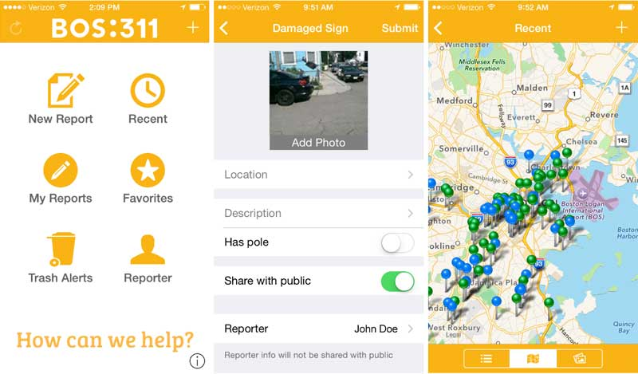

--- 
title: "Ethical Analysis of Boston 311 Service: Observational Study"
author: "Li Sun, Yanqi Luo, Ziye Tao, Matt Roth"
date: "`r Sys.Date()`"
site: bookdown::bookdown_site
---

# Introduction

Like many cities in the U.S., Boston offers a 311 line to connect citizens with non-emergency city services. Issues such as potholes, dirty streets, broken street lights, and graffiti can be reported to the City by telephone, Twitter, web, or an app. Upon receiving a request, the City opens a case, assigns a case manager, and manages the issue through resolution. Progress and results are documented in a Constituent Relationship Management system, and made available to the public through the City’s open data portal, Analyze Boston.

{width=50%}

Citizens are more likely to file 311 reports if 

- They have high levels of trust in city government
- They have time on their hands
- They have highly visible issues in their communities
- They consider 311 to be the best recourse to address their problems

These characteristics are likely to vary across individuals and communities due to historical and cultural factors. The case management and response process may be affected by historical bias. Some citizens’ or communities’ problems may be taken more seriously due to their status within society. Thus, this study combines the 311 service request datasets with demographic data, such as income, education level, poverty rate, race distribution, poverty rate, to answer the question:

**Does Boston provide 311 services fairly and equally to all citizens?**

For more details of this project, click the [**link here**](https://colab.research.google.com/drive/1q_iUwBBmyik1JekXhnC_GnLUJ8p4sfx2?usp=sharing) to view the notebook of this project.

